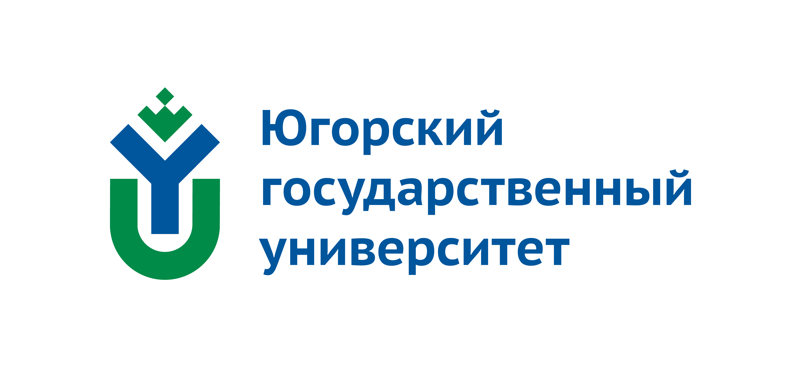

# **Описание проекта**

## Название проекта
Внедрение стандартов Worldskills Russia в образовательный процесс Университета (Югорский государственый университет)

## Регион текущей реализации
Ханты-Мансийск АО

## Суть проекта
Практико-ориентированное построение образовательного процесса путем внедрения независимой оценки качества подготовки бакалавриата с использованием стандартов Ворлдскиллс Россия.

## Цель проекта
Формирование дополнительных компетенций и независимая оценка качества подготовки с непосредственным участием работодателей и
сертифицированных экспертов.

## Эффекты от реализации
1. Приглашение работодателями преподавателей на стажировку и
студентов на практику .
2. Создание новых базовых кафедр.
3. Соответствие результатов демонстрационного экзамена обучающихся
порогу соответствия и выше – не менее 50 %.
4. Модернизация материально-технической базы университета.
5. Психо-эмоциональная подготовка участников демонстрационного
экзамена.
6. Повышение конкурентоспособности выпускников через увеличение
количества освоенных компетенций.
7. Повышение популярности специальностей.

## Конкурентные преимущества
1. Создание базы данных участников демонстрационного экзамена.
2. Предпочтительный прием работодателями выпускников, прошедших
независимую оценку качества по стандартам Ворлдскиллс Россия.
3. Выполнение аккредитационных требований - независимая оценка
качества подготовки специалистов.

## Лидер проекта
Ректор Карминская Татьяна Дмитриевна

## Адрес реализации проекта
628012, Ханты-Мансийский автономный округ - Югра, г. Ханты-Мансийск, ул. Чехова, 16.