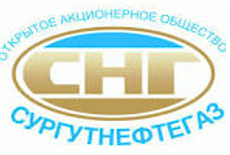
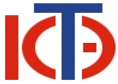

# ПРОЕКТ «Формирование системы практико-ориентированной подготовки кадров для предприятий и организаций региона»

## Цель проекта
Подготовка квалифицированных кадров для обеспечения потребностей региональной экономики и решения задач стратегического развития Ханты-Мансийского автономного округа - Югры

## Задачи проекта
- Разработка новых программ прикладного бакалавриата;
- Формирование банка данных необходимых компетенций выпускников совместно с ключевыми предприятиями региона;
- Обновление учебно-методического обеспечения программ прикладного бакалавриата;
- Оснащение лабораторий для реализации разработанных программ;
- Формирование базовых кафедр с ключевыми предприятиями региона;
- Повышение квалификации преподавателей ВУЗа;
- Приглашение сторонних преподавателей и квалифицированных специалистов из реального сектора экономики.

## Предприятия-партнеры по реализации Проекта

### ООО «РН-Юганскнефтегаз»
- Ведущее предприятие нефтегазодобычи и переработки РФ
- Разработка образовательных программ, формирование совместных лабораторий

### ОАО «Сургутнефтегаз»
- Ведущее предприятие нефтегазодобычи и переработки РФ
- Разработка образовательных программ, формирование совместных лабораторий

### ООО Салым Петролеум Девелопмент Н.В. 
- Совместное предприятие нефтегазодобычи
- Разработка образовательных программ, формирование совместных лабораторий

### ООО ОАО «Югорская территориальная энергетическая компания»
- Крупнейшая компания региона обеспечивающая передачу и сбыт электроэнергии
- Разработка образовательных программ, формирование базовой кафедры

### ОАО «Югорская региональная электросетевая компания»
- Ведущее предприятие обслуживания и эксплуатации систем электроснабжения
- Разработка образовательных программ, формирование совместных лабораторий

### ОАО «Югорская генерирующая компания»
- Ведущее предприятие выработки электрической энергии
- Разработка образовательных программ, формирование совместных лабораторий

### Югорский НИИ информационных технологий
- Ведущее предприятие округа моделирования в области нефтегазодобычи , разработки и эксплуатации информационно-аналитических систем
- Разработка образовательных программ, формирование базовой кафедры

## Бюджет проекта (млн.руб.)
|2013 год||2014 год||2016 год||
|--------||--------||-------||
|Субсидия|Софин.|Субсидия|Софин.|Субсидия|Софин.|
|50,000  |15,000|50,000  |15,000|00,000  |15,000|

## Перечень программ

### Нефтегазовое дело
- Развитие нефтегазового сектора - стратегическая задача Ханты-Мансийского автономного округа – Югры;
- Высокая заинтересованность реального сектора экономики, подтверждаемая инвестициями в университет и потребностью на рынке труда
- 6 филиалов реализуют программы СПО в городах Нижневартовск, Сургут, Нефтеюганск, Лангепас, Лянтор, Пыть-Ях.

### Электроэнергетика и электротехника
- Развитие электроэнергетики - стратегическая задача Ханты-Мансийского автономного округа – Югры;
- Высокая заинтересованность реального сектора экономики, подтверждаемая инвестициями в университет, потребность на рынке труда более 5000 специалистов;
- 3 филиала реализуют программы СПО в городах Нижневартовск, Лангепас, Лянтор.

### Информатика и вычислительная техника
- Информационные технологии - элемент обеспечивающий развитие и внедрение всех современных технологий и производств;
- Высокая заинтересованность реального сектора экономики, подтверждаемая инвестициями в университет и потребностью на рынке труда;
- 3 филиала реализуют программы СПО в городах Нижневартовск, Лангепас, Лянтор.

##  Прикладной бакалавриат
Это образовательная квалификация, присваиваемая выпускнику, закончившему основную образовательную программу высшего образования уровня бакалавриат:

- обладающего компетенциями по решению технологических задач в различных сферах социально-экономической деятельности, 
- готового приступить к профессиональной деятельности сразу после окончания вуза

Основные отличительные особенности программ прикладного бакалавриата связаны с ориентацией на конкретного работодателя, который:

- принимает непосредственное участие в проектировании и реализации образовательных программ,
- организует производственные практики, объем которых увеличен в полтора -два раза в сравнении с программами академического бакалавриата

В программы прикладного бакалавриата:

- предусмотрено присвоение квалификаций рабочего или должности служащего по профилю подготовки,
- в структуру программ заложены элементы сопряжения с профессиональными программами соответствующего профиля (программы СПО)

##  Участие предприятий партнеров
Совместная разработка и согласование учебно-методического обеспечения образовательных программ:

- виртуальные лаборатории;
- образовательные курсы;
- практикумы;
- электронные учебники;
- симуляторы; 
- тренажеры;

Софинансирование: 

- предоставление баз практик и разработка совместных программ;
- привлечение ППС, сотрудников и студентов через проектное обучение;
- выполнение совместных НИР;
- укрепление материальной базы;
- создание базовых кафедр на производстве.

## Информатика и вычислительная техника
**Материально-Технической обеспечение образовательного процесса:**

1. Лабораторный комплекс "Система управления насосной перекачивающей станцией".
2. Лабораторно-исследовательский комплекс по изучению устройств, преобразующих физико-химические величины, характеризующие состояние технологического процесса в объекте управления, в удобный для использования сигнал
3. Лабораторно-исследовательский комплекс по изучению контроля и управления механическим перемещением
4. Лабораторный комплекс «Средства автоматизации и управления в максимальной конфигурации»
5. Учебно-лабораторный комплекс «Умный дом»
6. Образовательный робототехнический комплекс.
7. Лаборатория сетевых технологий
8. Лаборатория администрирования и баз данных.

**Состав участников проекта:**

Задействовано 23 преподавателя, из них 8 до 35 лет.

- докторов наук - 4
- кандидатов наук - 11
- представителей реального сектора - 1
- представителей СПО - 2
- преподавателей, аспирантов – 5

**Курсы повышения квалификации:**

1. ОВЕН ПЛК110/160 в среде CoDeSys2.3: продвинутый учебный курс – 1 человек
2. Разработка распределенных АСУТП в SCADA и SOFTLOGIC-системе TRACE MODE 6 – 1 человек
3. Электронно-методический комплекс. Дидактические возможности и технологии 
4. электронный средств обучения – 1 человек
5. MATLAB Fundamentals – 7 человек
6. Java Сквозной Курс от А до Я. От Java программирования до разработки Java EE7 7. Web и EJB приложений с использованием баз данных – 6 человек
8. Oracle Database 11g: SQL Fundamentals – 6 человек

## Электроэнергетика и электротехника

** Тренажерный комплекс «Малая генерация – РЭС» **  
Для обучения студентов и электротехнического персонала практическим навыкам при обслуживании и ремонте оборудования распределительных устройств и электрических сетей, цифровых устройств релейной защиты и автоматики;

**Тренажерный комплекс с возможностью удаленного обучения «Техническое обслуживание и  ремонт в  электросетевом     предприятии»**  
Для  дистанционного обучения студентов и электротехнического персонала практическим навыкам при обслуживании и ремонте оборудования распределительных устройств и электрических.

**Мобильный тренажерный комплекс «Низковольтная аппаратура» **  
На базе оборудования Самараэлектрощит и Schneider Electric для обучения работе и обслуживанию высокотехнологичного оборудования в условиях производства при организации сетевого обучения совместно с предприятиями округа. 

**Тренажерный комплекс по эксплуатации нефтяных скважин оборудованных УЭЦН (установками центробежных электронасосов)**  
Обеспечение безопасной  эксплуатации скважин, снижение негативного влияния "человеческого фактора".

**Состав исполнителей проекта:**  
Всего 24 человека   
Из них :

- докторов наук - 3
- кандидатов наук - 13
- представителей реального сектора - 1
- представителей СПО - 3
- заведующих кафедрами - 5
- представителей ВУЗов - партнеров  - 4

**Курсы повышения квалификации:**  

1. Энергоменеджмент организаций и учреждений – 3 человека;  
2. Энергоэффективные методы преобразования и передачи электрической энергии в нефтегазовой области – 10 человек;

## Нефтегазовое дело

**Материально-Технической обеспечение образовательного процесса:**

1. Лаборатория «Буровые и тампонажные растворы и смеси». В лаборатории планируется установить оборудование для исследования фильтрационных и структурно-реологических параметров,  как буровых, так и тампонажных растворов. 
2. Лаборатория «Нефтегазопромысловая геология и геохимия». В лаборатории планируется установить хроматографы, инфракрасные спектрометры, оборудование для определения физико-химических свойств, а также установкой для исследования пластовых нефтей.
3.  Лаборатория «Технологии бурения скважин». В лаборатории планируется установить макетыи приборы, такие как ВИТР-ОТ, ПОАП-2М, УМГП-3, ПОК,Пресс Controls 65-L11G2/C, Буровой насос НБ-3 (120/40)
4. Лаборатория «Бурового оборудования и инструмента». В лаборатории планируется расположить буровой инструмент по видам бурения

**Состав исполнителей проекта:**  
Всего 22 человека  
Из них :

- докторов наук - 1
- кандидатов наук - 14
- представителей реального сектора - 1
- представителей СПО – 3
- преподавателей - 3

**Курсы повышения квалификации:**
1. Буровое дело в нефтегазовом производстве– 9 человек;
2. Бурение нефтяных и газовых скважин – 9человек.

## Основные результаты
- Повышение качества подготовки кадров по приоритетным направлениям развития региона
- Формирование устойчивых и эффективных связей с реальным сектором экономики в области подготовки кадров
- Разработка программ прикладного бакалавриата и формирование базовых кафедр с ведущими предприятиями региона
- Формирование сквозных программ подготовки кадров в рамках образовательного комплекса Югорского государственного университета
- Увеличение инвестиционной привлекательности образовательного комплекса Югорского государственного университета

## Влияние  проекта на социально-экономическое развитие региона
- Обеспечение стратегических отраслей региональной экономики квалифицированными специалистами, обладающими необходимым набором профессиональных компетенций
- Снижение кадрового дефицита и миграционной зависимости в стратегических отраслях экономики региона, снижение расходов на адаптацию молодых специалистов на производстве 
- Повышение эффективности и престижности учреждений СПО образовательного комплекса Югорского государственного университета 
- Развитие предприятий нефтегазового сектора, электроэнергетики и информационных технологий
- Повышение доли выпускников трудоустроенных в первый год после окончания ВУЗа

